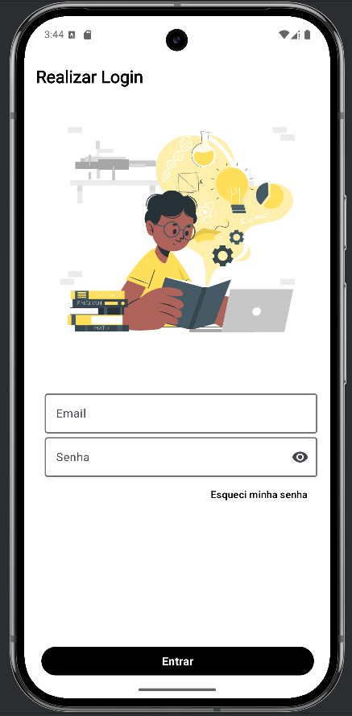

# Acervo Virtual

This is a Library Management App built with Kotlin for Android. The app allows users to manage a collection of books, including adding, updating, and deleting books. It also supports user authentication and displays book covers using Glide.

## Features

- User authentication
- Add, update, and delete books
- Display book covers with loading and error placeholders
- Store book data in SQLite database

## Requirements

- Android Studio Ladybug Feature Drop | 2024.2.2
- Kotlin 1.8.10
- Glide 4.15.1
- Minimum SDK version 21

## Setup

1. **Clone the repository:**

   ```sh
   git clone https://github.com/ohannadeziderio/acervo-virtual.git
   cd acervo-virtual
    ```
2. **Open the project in Android Studio:**
3. **Run the app**

## Usage
Try adding, updating, and deleting books. You can also sign in with the following credentials:
1. **Sign in:**
   - Email: `admin`
   - Password: `admin`
2. **View book covers:**
3. **Add a book:**
4. **Update a book:**
5. **Delete a book:**
6. **Sign out:**

## Screenshots

<p align="center">
  
  
  
</p>

## License

This project is licensed under the MIT License - see the [LICENSE](LICENSE) file for details.
